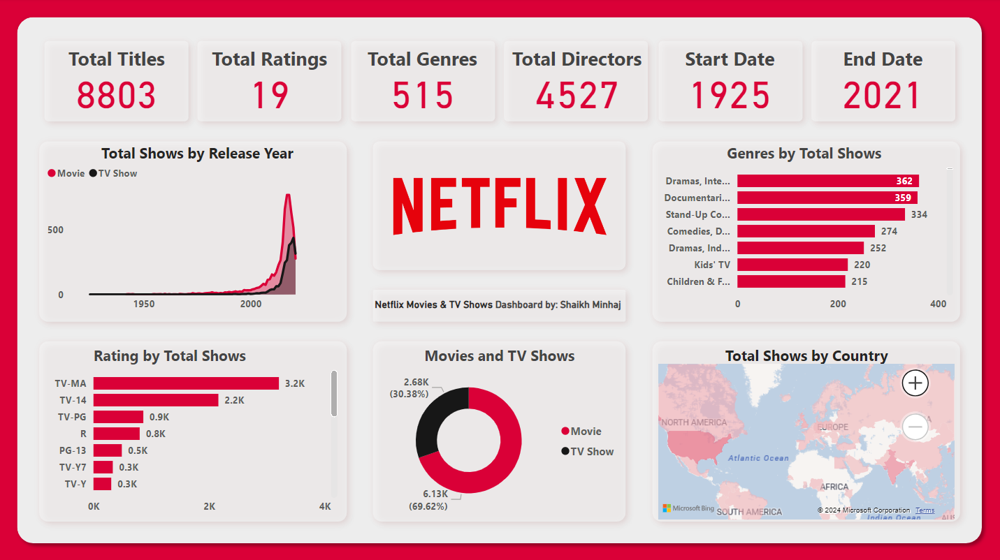

# 🎬 Netflix Viewing Trends and Content Insights Dashboard (Power BI)

  

## 📄 Overview
This project presents an **interactive Power BI dashboard** that analyzes Netflix’s massive library of over **8,000+ movies and TV shows**.  
The goal is to uncover insights on content distribution, release year trends, audience ratings, and country-wise production data — enabling a deeper understanding of Netflix’s global entertainment catalog.

---

## 🧰 Technologies Used
- **Tools:** Power BI, Power Query  
- **Languages (optional preprocessing):** Python, DAX  
- **Data Source:** Netflix Titles Dataset (from Kaggle / public dataset)  
- **File Type:** CSV  

---

## 🗂️ Dataset
- **Records:** 8,807 entries  
- **Columns:** `show_id`, `type`, `title`, `director`, `cast`, `country`, `release_year`, `rating`, `duration`, `listed_in`, `description`  
- **Goal:** To explore content trends, visualize movie vs. TV show distribution, and analyze genre, ratings, and year-based patterns.

---

## 🚀 Key Features
1. **Content Distribution Analysis:** Movies vs. TV Shows comparison by count, country, and year.  
2. **Genre Exploration:** Breakdown of the most popular genres and categories across countries.  
3. **Ratings Dashboard:** Analysis of ratings (PG, TV-MA, etc.) and audience segmentation.  
4. **Director & Cast Insights:** Identify top contributors and their works over time.  
5. **Country-Wise Production Map:** Global distribution of Netflix content origins.  
6. **Release Trend Analysis:** Visual representation of content growth since 2000.  

---

## 📊  Dashboards
- **Movie vs TV Show Comparison**
- **Genre Popularity Heatmap**
- **Country-wise Production Overview**
- **Top Directors and Actors**
- **Ratings Distribution and Viewer Demographics**
- **Yearly Release Trends (1925–2021)**

---

## 🔧 Setup Instructions
1. Download or clone this repository.  
2. Open the `.pbix` file in **Power BI Desktop**.  
3. Load the dataset `netflix_titles.csv`.  
4. Review applied transformations in **Power Query Editor**.  
5. Explore visuals, filters, and slicers within the dashboard.  

---

## 🔍 Key Insights
- **TV Shows dominate Netflix’s library growth** post-2015.  
- **United States and India** lead in total content production.  
- **“Documentaries” and “International Movies”** are among the fastest-growing categories.  
- A significant rise in **TV-MA rated** content reflects Netflix’s mature audience focus.  

---

## 🔗 Additional Resources
- [Netflix Dataset (Kaggle)](https://www.kaggle.com/datasets/shivamb/netflix-shows)  
- [Power BI Documentation](https://learn.microsoft.com/en-us/power-bi/)  
- [DAX Guide](https://dax.guide/)  

